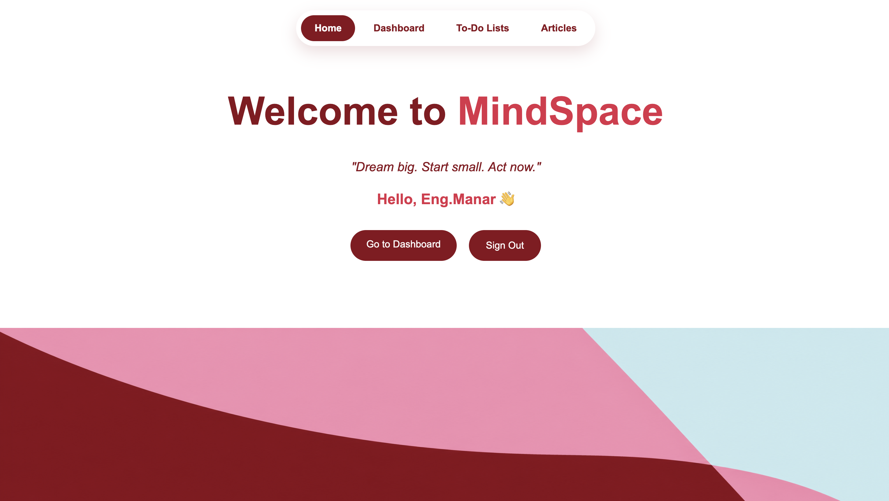

# 🧠 Mindspace

## MindSpace is a productivity web application built with the MEN Stack (MongoDB, Express.js, and Node.js). It allows users to create personal to-do lists, manage tasks, and write articles in one place.



## 🎮 Getting Started

### 🖥️ Live Demo


### 🚥 Run Locally

1. Clone the repository:
   ```bash
   git clone https://github.com/ManarALHamad/MindSpace.git
   ```

2. Navigate to the project folder:
   ```bash
   cd MindSpace
   ```

3. Install dependencies:
   ```bash
   npm install
   ```

4. Create a `.env` file and add:
   ```env
   MONGODB_URI=your_mongodb_connection_string
   SESSION_SECRET=your_session_secret
   ```

5. Start the server:
   ```bash
   nodemon
   ```
5. Open your browser and visit:
   ```
   http://localhost:3000

## 💕 Features

- User authentication (Sign Up & Sign In)
- Create and manage to-do lists
- Add tasks with descriptions and due dates
- Create and publish articles
- View public articles
- Edit and delete lists, tasks, and articles

## 💕 Future Improvements

- Messaging between users
- AI-powered productivity assistant
- Quotes section
- Task reminders and notifications
